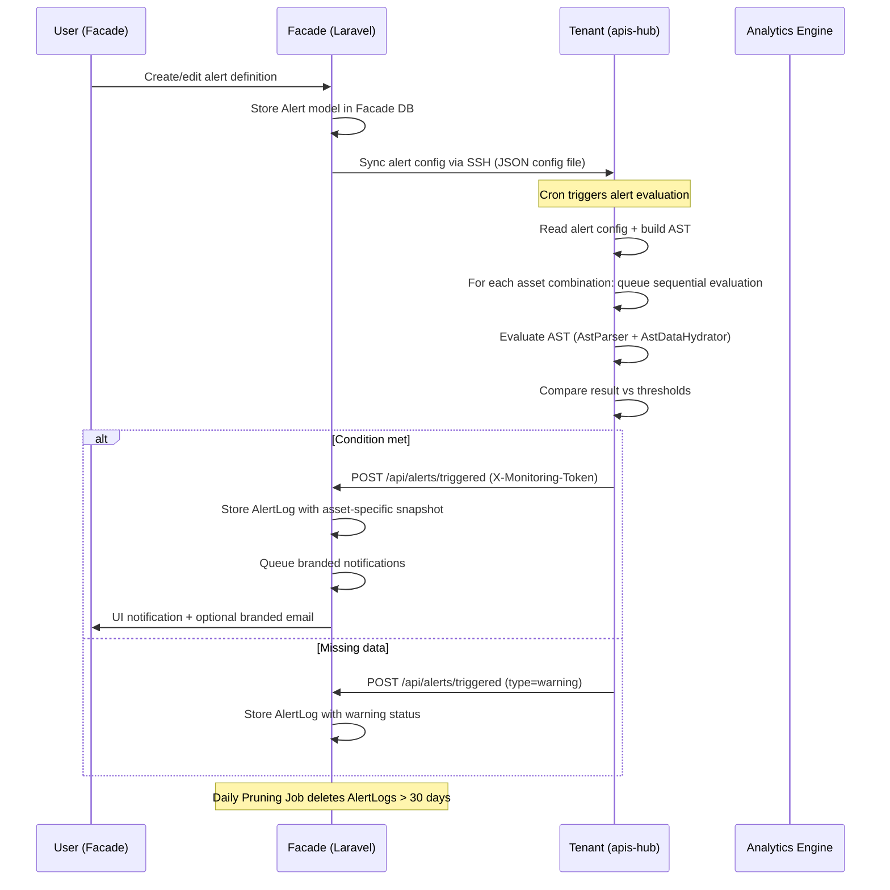

# Implement Alert Feature (Issue #111)

## Problem Statement

Users need the ability to define threshold-based alerts on KPI/metric measurements, so the system proactively notifies them (via UI and/or email) when a monitored value crosses a defined boundary. This is the **self-calculated** alert type — third-party alerts (e.g. Meta Ads Webhooks) are deferred to a follow-up plan.

## Architecture Overview

The alert lifecycle spans **two codebases** and follows the established Facade↔Tenant communication pattern:



> [!IMPORTANT]
> **AST Reuse Strategy:** The tenant's alert evaluator will reuse the **exact same** `AstParser`, `AstDataHydrator`, and `EvaluationContext` classes already used by `AnalyticsController::computeKpi()`. The alert definition's AST is structurally identical to a KPI/DM AST — the only addition is the threshold comparison step that wraps the evaluated result. **No AST logic is duplicated.**

---

## Confirmed Design Decisions (from user feedback)

### 1. Sequential Evaluation Queue

Simultaneous alerts are calculated **sequentially in a loop** (one after another). AST evaluations are highly performant and the DB model is optimized for millions of rows — no single alert calculation should cause issues or hang. No parallelism needed.

### 2. 2-Hour Sync Window Warning

When scheduling an alert, the UI must **warn the user** if the scheduled time falls within a **2-hour window after the last channel's daily sync** for the project. The recommendation is to schedule alerts AFTER that window to ensure all data is properly synced. This uses the project's timezone for comparison.

### 3. Widget-Level Config Specificity

Alerts must be configurable with the **same specificity as current widget configs**: specific channels, specific metrics, specific KPIs/DMs, and **explicit asset selections per calculation line**. Asset groups serve only as a convenience filter in the UI to narrow down the asset picker — the actual alert stores **concrete asset IDs** per series slot. No indefinition allowed.

### 4. Missing Data → Warning Log

When an alert calculation cannot be performed due to missing data (missing asset, missing records for the date range), a **warning-type log** is returned to Facade so the user knows what happened. This is not a silent failure.

### 5. Multi-Asset = Multiple Calculations = Multiple Logs

If an alert is configured for multiple assets or asset combinations, **each combination is a separate calculation** queued in the loop. Each produces its **own log entry** with the specific asset combination used. This ensures full traceability per asset.

### 6. Billing: Counted by Derived Calculations, Not Alert Records

The tier limit counts the total number of **derived calculation lines** (asset×series combinations) across all alerts, not the number of alert records. This means the user must specify exact asset pairs on configuration, and each pair counts as 1 unit. Limits match the existing account limits per tier:

- Free: 5 | Pro: 100 | Ultra/Founder: 500 | Enterprise: 500 (base) | Suspended: 0

### 7. All Aggregation Methods Available

User can select any of: `latest`, `sum`, `avg`, `min`, `max` per alert.

### 8. Branded Email Templates Always

Emails use branded templates matching the existing SaaS identity.

### 9. Project Timezone Governs Everything

All scheduling, sync window comparisons, and time displays use the **project's timezone** (`Project.timezone` field, already exists in the model). No per-alert timezone field. The timezone is inherited from the project scope.

### 10. Side Feature: Project Clock in Top Bar

A live clock widget is added to the top bar (to the right of the beta badge, using `GLOBAL_SEARCH_BEFORE` render hook), showing the current time in the project's timezone with the timezone abbreviation in parentheses.

### 11. 30-Day Log Retention & Automatic Hard Pruning 🆕

Since every calculation line generates execution logs (`triggered`, `ok`, `warning`), Facade's DB could accumulate excessive records over time.

- **User Notice:** In the alert logs UI/relation manager, an explicit banner advises the user: _"Audit Retention Notice: Alert logs are retained for 30 days for audit purposes and are automatically hard-deleted after that period."_
- **Automated Hard Pruning:** The `AlertLog` model implements Laravel's `Prunable` trait to hard-delete records older than 30 days (`created_at < now()->subDays(30)`). A daily scheduler job (`model:prune`) purges old logs automatically.

---

## Communication Method ✅

Uses the **HTTP callback** pattern: Tenant POSTs to Facade with `X-Monitoring-Token` header — exactly like [MonitoringController::heartbeat()](file:///d:/laragon/www/apis-hub-facade/app/Http/Controllers/MonitoringController.php#L14) and [MonitoringController::authFailed()](file:///d:/laragon/www/apis-hub-facade/app/Http/Controllers/MonitoringController.php#L49). The tenant does NOT need a DB migration — alert config is stored as a JSON file, consistent with the channel config pattern.

---

## Proposed Changes

### Component 1: Facade — Data Model

---

#### [NEW] `database/migrations/2026_XX_XX_000001_create_alerts_table.php`

Creates the `alerts` table:

| Column               | Type                    | Notes                                                                          |
| -------------------- | ----------------------- | ------------------------------------------------------------------------------ |
| `id`                 | bigIncrements           | PK                                                                             |
| `project_id`         | foreignId               | FK → projects                                                                  |
| `user_id`            | foreignId               | FK → users (creator/owner for notifications)                                   |
| `name`               | string                  | Human-readable label                                                           |
| `description`        | text, nullable          | Optional explanation                                                           |
| `source_type`        | string                  | `metric`, `kpi`, `derived_metric` — mirrors widget source types                |
| `source_config`      | json                    | Channel, metric key — same shape as widget `source_config`                     |
| `ast`                | json                    | The AST tree — **identical schema** to `CustomKpi.ast` / `DerivedMetric.ast`   |
| `filters`            | json                    | Date range offsets, `groupBy`, etc.                                            |
| `aggregation_method` | string                  | `latest`, `sum`, `avg`, `min`, `max`                                           |
| `upper_limit`        | decimal(20,6), nullable | Upper threshold — alert fires when value ≥ upper                               |
| `lower_limit`        | decimal(20,6), nullable | Lower threshold — alert fires when value ≤ lower                               |
| `notify_ui`          | boolean, default true   | Send in-app notification                                                       |
| `notify_email`       | boolean, default false  | Send email notification                                                        |
| `schedule_type`      | string                  | `daily`, `weekly`, `biweekly`, `monthly`, `once`                               |
| `schedule_config`    | json                    | `{ time: "08:00", day_of_week: 1, days_of_month: [1,15], date: "2026-09-01" }` |
| `next_evaluation_at` | timestamp, nullable     | Pre-computed next run time (UTC-converted from project TZ)                     |
| `last_evaluated_at`  | timestamp, nullable     | Last evaluation timestamp                                                      |
| `last_triggered_at`  | timestamp, nullable     | Last time alert condition was met                                              |
| `is_active`          | boolean, default true   | Soft enable/disable                                                            |
| `timestamps`         |                         | `created_at`, `updated_at`                                                     |
| `softDeletes`        |                         | `deleted_at`                                                                   |

Indexes: `(project_id, is_active, next_evaluation_at)`.

#### [NEW] `database/migrations/2026_XX_XX_000002_create_alert_calculation_lines_table.php`

Creates the `alert_calculation_lines` table. Each line represents one concrete asset combination that will be evaluated as a separate calculation:

| Column         | Type               | Notes                                                                                                                                    |
| -------------- | ------------------ | ---------------------------------------------------------------------------------------------------------------------------------------- |
| `id`           | bigIncrements      | PK                                                                                                                                       |
| `alert_id`     | foreignId          | FK → alerts (cascade delete)                                                                                                             |
| `label`        | string, nullable   | Human-readable label for this specific line (e.g. "Campaign Alpha - act_123")                                                            |
| `asset_filter` | json               | Concrete asset IDs per series slot: `{ "dependent": "act_123", "independent_a": "act_456" }` or `{ "0": ["act_123"] }` for metric source |
| `sort_order`   | integer, default 0 | Display/evaluation order                                                                                                                 |
| `timestamps`   |                    |                                                                                                                                          |

Each alert has **one or more** calculation lines. Each line = 1 calculation = 1 potential log entry = 1 unit toward the tier billing limit.

#### [NEW] `database/migrations/2026_XX_XX_000003_create_alert_logs_table.php`

Creates the `alert_logs` table for traceability (requirement #8):

| Column                      | Type                    | Notes                                                                                  |
| --------------------------- | ----------------------- | -------------------------------------------------------------------------------------- |
| `id`                        | bigIncrements           | PK                                                                                     |
| `project_id`                | foreignId               | FK → projects                                                                          |
| `alert_id`                  | foreignId, nullable     | FK → alerts (nullable: log survives alert deletion)                                    |
| `alert_calculation_line_id` | foreignId, nullable     | FK → lines (nullable: survives deletion)                                               |
| `alert_name`                | string                  | Snapshot of alert name at trigger time                                                 |
| `alert_description`         | text, nullable          | Snapshot of description                                                                |
| `source_type`               | string                  | Snapshot of source_type                                                                |
| `source_summary`            | string                  | Human-readable "facebook_marketing.spend" or "CPC (DM #12)"                            |
| `asset_summary`             | string                  | Human-readable asset label for this calculation line                                   |
| `ast_snapshot`              | json                    | Frozen copy of the AST at trigger time                                                 |
| `asset_filter_snapshot`     | json                    | Frozen copy of the asset_filter for this line                                          |
| `evaluated_value`           | decimal(20,6), nullable | The computed value (null if warning)                                                   |
| `threshold_type`            | string, nullable        | `upper`, `lower`, or null (for warnings)                                               |
| `threshold_value`           | decimal(20,6), nullable | The limit that was breached (null for warnings)                                        |
| `aggregation_method`        | string                  | Snapshot                                                                               |
| `evaluation_window`         | json                    | `{ start: "...", end: "..." }` — the date range evaluated                              |
| `status`                    | string                  | `triggered`, `ok`, `warning` — warning = missing data or evaluation error              |
| `warning_message`           | text, nullable          | Explanation when status=warning (e.g. "No data found for asset act_123 in date range") |
| `notified_ui`               | boolean                 | Whether UI notification was sent                                                       |
| `notified_email`            | boolean                 | Whether email was sent                                                                 |
| `triggered_at`              | timestamp               | When the condition was detected (by tenant)                                            |
| `created_at`                | timestamp               | When Facade received and stored it (indexed for pruning)                               |

Key design: logs are **self-contained snapshots** — they store everything needed for traceability even after the alert is deleted (requirement #8). Index on `created_at` allows fast 30-day pruning queries.

---

### Component 2: Facade — Models & Pruning Service

---

#### [NEW] `app/Models/Alert.php`

Eloquent model with:

- `$casts`: `ast` → array, `filters` → array, `source_config` → array, `schedule_config` → array, `is_active` → boolean, `notify_ui` → boolean, `notify_email` → boolean
- Relations: `belongsTo(Project)`, `belongsTo(User)`, `hasMany(AlertLog)`, `hasMany(AlertCalculationLine)`
- `SoftDeletes` trait
- `computeNextEvaluationAt(): ?Carbon` — calculates next run based on `schedule_type`, `schedule_config`, and the **project's timezone** (`$this->project->timezone`). Returns `null` for `once` type that already ran.
- `getTotalCalculationLines(): int` — counts calculation lines for billing
- Scope: `scopeActive($query)`, `scopeDue($query)` (where `next_evaluation_at <= now()`)

#### [NEW] `app/Models/AlertCalculationLine.php`

Eloquent model with:

- `$casts`: `asset_filter` → array
- Relations: `belongsTo(Alert)`, `hasMany(AlertLog)`

#### [NEW] `app/Models/AlertLog.php`

Eloquent model with:

- Uses `Illuminate\Database\Eloquent\Prunable`
- `$casts`: `ast_snapshot` → array, `evaluation_window` → array, `asset_filter_snapshot` → array, `notified_ui` → boolean, `notified_email` → boolean
- Relations: `belongsTo(Alert)`, `belongsTo(Project)`, `belongsTo(AlertCalculationLine)`
- **Pruning Implementation:**

    ```php
    use Illuminate\Database\Eloquent\Prunable;
    use Illuminate\Database\Eloquent\Builder;

    class AlertLog extends Model
    {
        use Prunable;

        public function prunable(): Builder
        {
            // Automatically hard-delete log records older than 30 days
            return static::where('created_at', '<', now()->subDays(30));
        }
    }
    ```

#### [MODIFY] [routes/console.php](file:///d:/laragon/www/apis-hub-facade/routes/console.php)

Register the daily model pruning schedule:

```php
\Illuminate\Support\Facades\Schedule::command('model:prune', [
    '--model' => [\App\Models\AlertLog::class],
])->daily();
```

#### [NEW] `app/Services/AlertService.php`

Centralized service for alert lifecycle:

- `syncAlertsToTenant(Project $project): array` — Gathers all active alerts with their calculation lines, serializes to JSON config, and pushes to the tenant via SSH (`DeployerService::runSshCommands` writing to `/var/www/apis-hub/tenants/{subdomain}/config/alerts.json`). Each alert entry includes its calculation lines so the tenant knows each asset combination to evaluate.
- `handleTriggeredAlert(Project $project, array $payload): void` — Receives the webhook payload from the tenant, creates an `AlertLog` with full snapshot, dispatches notifications based on status (triggered → notify, warning → log only, ok → log only).
- `buildAlertSummary(Alert $alert): string` — Generates a human-readable source summary for log snapshots.
- `computeNextEvaluationForAll(Project $project): void` — Batch-updates `next_evaluation_at` for all active project alerts using the project's timezone.
- `countTotalCalculationLines(Project $project): int` — Counts all calculation lines across all active alerts for a project. Used for tier limit enforcement.
- `getSyncWindowWarning(Project $project, string $scheduledTime): ?string` — Checks if the scheduled time falls within a 2-hour window after any channel's daily sync completion. Returns a warning message or null. Uses the project's timezone.

---

### Component 3: Facade — Alert Configuration UI (Filament Resource)

---

#### [NEW] `app/Filament/App/Resources/AlertResource.php`

Filament resource under the **Analytics** navigation group (same group as Dashboards, KPIs, DMs). Form uses a wizard similar to `DerivedMetricResource`:

**Wizard Steps:**

1. **Source** — Select `source_type` (metric/kpi/derived_metric). For `metric`: channel + metric selectors (reuses `KpiFormBuilder::getChannelOptions()` / metric resolution). For `kpi`: select from existing `CustomKpi` records (loads the KPI's AST). For `derived_metric`: select from existing `DerivedMetric` records (loads the DM's AST + source_series). This step builds the AST from the selected source — **reusing the same `KpiPayloadBuilder::buildAstFromState()` method** used by widgets.
2. **Assets** — Per-series asset selection. Shows the series slots derived from the source (dependent + independent for KPIs, source_series keys for DMs, single slot for metrics). Each slot has:
    - An **asset group dropdown** (for filtering only — narrows the asset list)
    - A **concrete asset multi-select** (the user picks exact assets)
    - Each unique asset combination across slots becomes an `AlertCalculationLine`
    - A **calculation lines preview** showing how many lines/calculations will result, with a billing counter: "Using X of Y alert calculations (Tier limit)"
3. **Condition** — Define `upper_limit` and/or `lower_limit` + `aggregation_method` selector (`latest`, `sum`, `avg`, `min`, `max`). Explanation text for each method.
4. **Schedule** — `schedule_type` radio (daily/weekly/biweekly/monthly/once) + conditional config fields (time picker, day-of-week select, days-of-month multi-select, datetime picker for once). All times displayed and stored relative to the **project's timezone**.
    - **2-hour sync window warning:** When the user sets a time, the system checks if it falls within 2 hours of the last channel's daily sync time (read from `sync_config`). If so, an amber warning banner appears: _"⚠️ This schedule falls within 2 hours of your daily data sync ({sync_time}). We recommend scheduling after {recommended_time} to ensure all data is fully synced."_
5. **Notifications** — Toggle `notify_ui` / `notify_email`. Shows preview of notification text.
6. **Details** — `name`, `description`, `is_active` toggle. Summary of total calculation lines + tier usage.

**Table columns:** Name, Source (badge), Schedule (humanized in project TZ), Calculation Lines (count), Last Evaluated, Last Triggered, Active toggle, actions (edit, view logs, delete).

#### [NEW] `app/Filament/App/Resources/AlertResource/Pages/ListAlerts.php`

#### [NEW] `app/Filament/App/Resources/AlertResource/Pages/CreateAlert.php`

#### [NEW] `app/Filament/App/Resources/AlertResource/Pages/EditAlert.php`

Standard Filament resource pages. `CreateAlert` and `EditAlert` call `DeployerService::syncAlertConfig()` after save and `AlertService::computeNextEvaluationForAll()`.

#### [NEW] `app/Filament/App/Resources/AlertResource/RelationManagers/AlertLogsRelationManager.php`

Shows the alert's log history with an **Audit Retention Notice Banner**:

> ℹ️ **Retention Notice:** Alert execution and audit logs are stored for **30 days** for diagnostic and auditing purposes. Entries older than 30 days are automatically hard-deleted.

Columns: Triggered At, Asset Summary, Status (badge: green=ok, amber=warning, red=triggered), Evaluated Value, Threshold (type + value), Warning Message (visible when status=warning), Notification Status (UI/Email badges), Evaluation Window. Read-only — logs are never editable.

#### [NEW] `app/Filament/App/Resources/AlertResource/RelationManagers/CalculationLinesRelationManager.php`

Shows/manages the alert's calculation lines. Columns: Label, Asset Filter (human-readable), Sort Order. Editable inline.

---

### Component 4: Facade — Webhook Receiver & Notifications

---

#### [MODIFY] [MonitoringController.php](file:///d:/laragon/www/apis-hub-facade/app/Http/Controllers/MonitoringController.php)

Add a new `alertTriggered()` method following the exact same pattern as `heartbeat()` and `authFailed()`:

```php
public function alertTriggered(Request $request): Response
{
    // 1. Validate X-Monitoring-Token → find project
    // 2. Validate payload: alert_id, calculation_line_id, evaluated_value,
    //    threshold_type, threshold_value, evaluation_window, status
    // 3. Find Alert by ID + project_id
    // 4. Create AlertLog with full snapshot (survives deletion):
    //    - alert_name, source_type, source_summary, asset_summary
    //    - ast_snapshot, asset_filter_snapshot
    //    - status: 'triggered' | 'ok' | 'warning'
    //    - warning_message (when status=warning, e.g. "No data for act_123")
    // 5. If status=triggered AND alert still exists:
    //    - Dispatch AlertTriggeredNotification to alert->user
    //    - Update alert: last_triggered_at
    // 6. Update alert: last_evaluated_at, compute next_evaluation_at
    // 7. Return success JSON
}
```

**Idempotency:** Duplicate callbacks for the same `(alert_id, calculation_line_id, triggered_at)` are deduplicated via a unique composite index on `alert_logs`.

#### [MODIFY] [routes/web.php](file:///d:/laragon/www/apis-hub-facade/routes/web.php)

Add the new route alongside the existing monitoring routes (line 72):

```php
Route::post('/api/alerts/triggered', [MonitoringController::class, 'alertTriggered']);
```

#### [NEW] `app/Notifications/AlertTriggeredNotification.php`

Laravel Notification class implementing:

- `via()`: returns channels based on alert's `notify_ui` / `notify_email` flags → `['database']` and/or `['mail']`
- `toDatabase()`: Filament-compatible database notification (icon, title with alert name + asset, body with value + threshold, action URL to alert logs)
- `toMail()`: **Branded** Markdown email using the SaaS template, with alert name, asset combination, evaluated value, threshold, evaluation window, and a link to the Facade alert logs page

#### [NEW] `resources/views/emails/alert-triggered.blade.php`

Branded Markdown mail template matching the existing SaaS email identity.

---

### Component 5: Facade — Config Sync to Tenant

---

#### [MODIFY] [DeployerService.php](file:///d:/laragon/www/apis-hub-facade/app/Services/DeployerService.php)

Add a new method `syncAlertConfig(Project $project): array`:

```php
public function syncAlertConfig(Project $project): array
{
    $alerts = $project->alerts()
        ->active()
        ->with(['calculationLines', 'user'])
        ->get();

    $config = $alerts->map(fn (Alert $a) => [
        'id' => $a->id,
        'name' => $a->name,
        'source_type' => $a->source_type,
        'source_config' => $a->source_config,
        'ast' => $a->ast,
        'filters' => $a->filters,
        'aggregation_method' => $a->aggregation_method,
        'upper_limit' => $a->upper_limit,
        'lower_limit' => $a->lower_limit,
        'schedule_type' => $a->schedule_type,
        'schedule_config' => $a->schedule_config,
        'next_evaluation_at' => $a->next_evaluation_at?->toIso8601String(),
        'calculation_lines' => $a->calculationLines->map(fn ($line) => [
            'id' => $line->id,
            'label' => $line->label,
            'asset_filter' => $line->asset_filter,
        ])->toArray(),
    ])->toArray();

    $path = "/var/www/apis-hub/tenants/{$project->subdomain}";
    $json = json_encode($config, JSON_PRETTY_PRINT | JSON_UNESCAPED_SLASHES);
    $commands = [
        "mkdir -p {$path}/config",
        "cat > {$path}/config/alerts.json << 'ALERTEOF'\n{$json}\nALERTEOF",
    ];

    return $this->runSshCommands($project->server, $commands);
}
```

#### [MODIFY] [SyncSettings.php](file:///d:/laragon/www/apis-hub-facade/app/Filament/App/Pages/SyncSettings.php)

Add `ALERT_FACADE_URL` to the `.env` push (alongside `MONITOR_FACADE_URL`, line ~308):

```php
'ALERT_FACADE_URL' => config('app.url') . '/api/alerts/triggered',
```

---

### Component 6: Tenant (apis-hub) — Alert Evaluator Command

---

#### [NEW] `src/Commands/Analytics/EvaluateAlertsCommand.php`

A Symfony Console command (`app:evaluate-alerts`) that:

1. **Reads** `/config/alerts.json` (the config file pushed by Facade)
2. **Filters** to alerts where `next_evaluation_at <= now()`
3. **For each due alert**, iterates its `calculation_lines` **sequentially** (one after another in a loop):

    For each calculation line:

    a. **Injects asset filters** from `calculation_line.asset_filter` into the AST node filters

    b. **Parses the AST** using `AstParser::parse($alert['ast'])` — **reuses the exact same parser** from [AstParser.php](file:///d:/laragon/www/apis-hub/src/Services/Analytics/VirtualMetricEngine/AstParser.php)

    c. **Hydrates metric data** using `AstDataHydrator::hydrate($node, $filters)` — **reuses the exact same hydrator** from [AstDataHydrator.php](file:///d:/laragon/www/apis-hub/src/Services/Analytics/VirtualMetricEngine/AstDataHydrator.php)

    d. **Evaluates** using `$node->evaluate($context)` with [EvaluationContext](file:///d:/laragon/www/apis-hub/src/Services/Analytics/VirtualMetricEngine/EvaluationContext.php) — **reuses the exact same evaluator**

    e. **Handles missing data:** If data hydration or evaluation returns empty:
    - POST a **warning** callback to Facade with `status: 'warning'` and `warning_message: 'No data found for asset {id} in date range {start} to {end}'`
    - Continue to next calculation line

    f. **Aggregates** the result:
    - `latest`: take the last date's value
    - `sum`: `array_sum(array_values($result))`
    - `avg`: `array_sum / count`
    - `min`: `min(array_values($result))`
    - `max`: `max(array_values($result))`

    g. **Compares** against thresholds (`upper_limit`, `lower_limit`):
    - If value ≥ upper_limit → `status: 'triggered'`, `threshold_type: 'upper'`
    - If value ≤ lower_limit → `status: 'triggered'`, `threshold_type: 'lower'`
    - If neither → `status: 'ok'`

    h. **POST to Facade** with the result (triggered, ok, or warning) — one callback per calculation line

4. Does NOT update `next_evaluation_at` locally — Facade recomputes on webhook receipt

**Retry logic (requirement #10):** Exponential backoff (3 attempts with 2s/4s/8s delays). Local backup log on failure.

#### [MODIFY] Tenant cron entrypoint

Add `app:evaluate-alerts` command to cron schedule (1-minute tick).

---

### Component 7: Facade — Side Feature: Project Clock in Top Bar

---

#### [NEW] `resources/views/filament/hooks/project-clock.blade.php`

Blade view rendered via `GLOBAL_SEARCH_BEFORE` render hook to the right of the beta badge:

```html
<div class="flex items-center" x-data="projectClock()" x-init="startClock()">
    <span
        class="px-2 py-1 text-[11px] font-semibold text-gray-600 dark:text-gray-300 
                 bg-gray-100 dark:bg-gray-800 border border-gray-200 dark:border-gray-700 
                 rounded font-mono tracking-wide shadow-sm"
        x-text="currentTime"
    >
    </span>
</div>
```

Displays live time formatted with `Intl.DateTimeFormat` using the project's timezone (e.g. `12:45:30 PM (EST)`).

#### [MODIFY] [AppPanelProvider.php](file:///d:/laragon/www/apis-hub-facade/app/Providers/Filament/AppPanelProvider.php)

Register `project-clock` render hook with current tenant timezone.

---

### Component 8: Facade — Billing Integration

---

#### [MODIFY] [BillingLifecycleService.php](file:///d:/laragon/www/apis-hub-facade/app/Services/BillingLifecycleService.php)

Add `getMaxAlertCalculationsForTier(UserTier $tier): int` matching account limits:

- Free: 5 | Pro: 100 | Ultra/Founder: 500 | Enterprise: 500 | Suspended: 0

Calculated as the sum of `alert_calculation_lines` across all active alerts. Live counter in creation form wizard.

---

### Component 9: Facade — Navigation & i18n

---

#### [MODIFY] [AppPanelProvider.php](file:///d:/laragon/www/apis-hub-facade/app/Providers/Filament/AppPanelProvider.php)

Register `AlertResource` in the App panel.

#### [MODIFY] `lang/es.json`

Add Spanish translations for all alert-related strings, retention policy notices, sync window warnings, and clock displays.

---

## Proposed Changes Summary

| Repository | Component        | Files                                                              | Type   |
| ---------- | ---------------- | ------------------------------------------------------------------ | ------ |
| **Facade** | Data Model       | 3 migrations (alerts, calculation_lines, alert_logs)               | NEW    |
| **Facade** | Models           | `Alert.php`, `AlertCalculationLine.php`, `AlertLog.php` (Prunable) | NEW    |
| **Facade** | Console Schedule | `routes/console.php` (Model pruning schedule)                      | MODIFY |
| **Facade** | Service          | `AlertService.php`                                                 | NEW    |
| **Facade** | Filament UI      | `AlertResource.php` + 3 pages + 2 RMs (with Retention Notice)      | NEW    |
| **Facade** | Webhook          | `MonitoringController.php`                                         | MODIFY |
| **Facade** | Routes           | `routes/web.php`                                                   | MODIFY |
| **Facade** | Notifications    | `AlertTriggeredNotification.php` + branded mail template           | NEW    |
| **Facade** | Config Sync      | `DeployerService.php`                                              | MODIFY |
| **Facade** | Sync Settings    | `SyncSettings.php`                                                 | MODIFY |
| **Facade** | Billing          | `BillingLifecycleService.php`                                      | MODIFY |
| **Facade** | Navigation       | `AppPanelProvider.php`                                             | MODIFY |
| **Facade** | Top Bar Clock    | `project-clock.blade.php` + Alpine component                       | NEW    |
| **Facade** | Styles           | `filament-extras.css`                                              | MODIFY |
| **Facade** | JS               | `app.js` (register projectClock)                                   | MODIFY |
| **Facade** | i18n             | `lang/es.json`                                                     | MODIFY |
| **Tenant** | Evaluator        | `EvaluateAlertsCommand.php`                                        | NEW    |
| **Tenant** | Cron             | entrypoint/cron config                                             | MODIFY |

---

## Key Design Decisions

1. **Zero AST Duplication:** Reuses `AstParser` → `AstDataHydrator` → `EvaluationContext` → `node.evaluate()`.
2. **Config File Tenant Storage:** `/config/alerts.json` via SSH.
3. **Calculation Lines = Billing Unit:** Each concrete asset combination is a distinct calculation line counting toward tier limits.
4. **Self-Contained Snapshots:** Frozen metadata per log entry.
5. **3-Status Log Model:** `triggered`, `ok`, `warning` (for missing data).
6. **Automatic 30-Day Hard Pruning:** `AlertLog` implements `Prunable`, scheduled daily via `model:prune` in `routes/console.php` to hard-delete records older than 30 days.
7. **UI Retention Notice:** Explicit informational banner in the logs UI advising the user of the 30-day retention window.
8. **Project Timezone Scope:** Governs all scheduling, sync window checking, and time display.
9. **Project Clock Widget:** Real-time topbar clock displaying project time and timezone code.

---

## Verification Plan

### Automated Tests

**Facade:**

```bash
php artisan test tests/Feature/Analytics/AlertTest.php
php artisan test tests/Feature/Analytics/AlertWebhookTest.php
php artisan test tests/Feature/Analytics/AlertPruningTest.php
```

Planned test cases (~40-45):

- **Pruning tests:** Verify `AlertLog` records created 31 days ago are hard-deleted when `model:prune` runs, while logs created 29 days ago are preserved.
- **Model tests:** Alert creation, `computeNextEvaluationAt()`, calculation line counting, scope queries.
- **Webhook tests:** `alertTriggered()` endpoint validation, idempotency, status handling, warning message storage, snapshot integrity.
- **Notification tests:** UI and branded email notifications for `triggered` status, no notification for `ok` / `warning`.
- **Config sync & Tier limit tests:** JSON output validation, line-counting accuracy, quota enforcement.

**Tenant:**

```bash
php bin/cli.php app:evaluate-alerts --dry-run
```

- Verify sequential AST parsing, hydration, aggregation, missing data warning handling, retry backoff, and Facade callbacks.

### Manual Verification

- Verify retention policy notice banner on `AlertLogsRelationManager`.
- Test daily pruning command using artisan console.
- Perform end-to-end creation, sync, tenant evaluation, webhook trigger, and clock widget checks.
