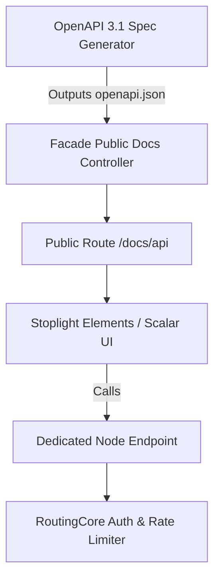

# Comprehensive Implementation Plan: API Specification & Public Documentation

## 1. Executive Summary
This document outlines the end-to-end plan to formalize the APIs Hub RESTful API specification into an interactive, public-facing developer portal. It details architecture decisions, route consolidation, OpenAPI 3.1 generation, documentation rendering, security, and developer experience (DevEx) enhancements.

---

## 2. Objectives
1. **Unified API Contract**: Generate and maintain an accurate, versioned OpenAPI 3.1 specification representing all client-accessible endpoints across normalized channel metrics, sync status, and ping/heartbeat health checks.
2. **Public Developer Documentation Portal**: Provide a modern, responsive, dark-mode-first documentation interface (matching the aesthetic of the features/plans pages) accessible publicly without exposing internal or cluster-management endpoints.
3. **Interactive Sandbox / Try-It Console**: Allow developers to test API requests directly from the browser using sandbox tokens or project keys.
4. **Developer Tooling**: Provide ready-to-run code snippets (cURL, Python, JavaScript, PHP, Power BI) and an exportable Postman collection.

---
## 3. Deep-Dive: Aggregation Endpoint Architecture & Schema (`/metric/aggregate`)

The aggregation engine (`POST /{channel}/metric/aggregate` and `POST /entity/metric/aggregate`) is the computational core of APIs Hub. It allows clients to run arbitrary multi-dimensional analytical queries with time-series groupings, relational filtering, and weighted formulas — identically to the internal dashboard widgets.

### 3.1 Request Payload Schema Specification

```json
{
  "aggregations": {
    "<alias_or_field>": "<formula_or_metric_key>"
  },
  "groupBy": [
    "<dimension_or_date_expression>"
  ],
  "filters": {
    "<field_or_dimension>": "<value_or_operator_object>"
  },
  "startDate": "YYYY-MM-DD",
  "endDate": "YYYY-MM-DD",
  "orderBy": "<field_or_alias>",
  "orderDir": "ASC | DESC",
  "limit": 5000
}
```

#### Field Specifications:

| Parameter | Type | Required | Description |
| :--- | :--- | :--- | :--- |
| `aggregations` | `object` | **Yes** | Key-value pairs where key is the output field name, and value is the metric field or weighted reduction formula (e.g. `'spend'`, `'clicks'`, `'cpc'`, `'ctr'`). |
| `groupBy` | `array<string>` | No | Dimensions to segment results by. Can include temporal expressions (`'date'`, `'week'`, `'month'`), relational keys (`'channeledAccount'`, `'channeledCampaign'`), or raw dimensions (`'query'`, `'device'`, `'country'`, `'dimensions.page'`). |
| `filters` | `object` | No | Constraints applied to records before aggregation. Supports exact equality or rich condition objects. |
| `startDate` | `string` | No | Beginning of date window (`YYYY-MM-DD`). |
| `endDate` | `string` | No | End of date window (`YYYY-MM-DD`). Drives aggregation caching strategies. |
| `orderBy` | `string` | No | Field or aggregation alias to sort by. |
| `orderDir` | `string` | No | Sort direction (`ASC` or `DESC`, default: `ASC`). |
| `limit` | `integer` | No | Row cap (default: 500, max: 5000). |

---

### 3.2 Filter Operator Schema

Filters support both simple scalar equality and structured operator objects:

1. **Scalar Value (Exact Match)**:
   ```json
   "filters": {
     "channeledAccount": "14",
     "country": "USA"
   }
   ```
2. **In Array (Multiple Select)**:
   ```json
   "filters": {
     "channeledAccount": { "operator": "in", "value": ["14", "28", "35"] }
   }
   ```
3. **Not Equal**:
   ```json
   "filters": {
     "dimensions.searchAppearance": { "operator": "not_equal", "value": "standard" }
   }
   ```
4. **Range / Comparison (`>`, `>=`, `<`, `<=`, `between`)**:
   ```json
   "filters": {
     "spend": { "operator": "greater_than", "value": 100 }
   }
   ```
5. **Partial Text Search (`contains`, `starts_with`)**:
   ```json
   "filters": {
     "query": { "operator": "contains", "value": "pricing" }
   }
   ```

---

### 3.3 Multiplicity of Use Cases & Sample Payloads

Below are concrete, production-grade payload examples mapping directly to the platform's widgets:

#### Case 1: KPI Summary Card (Headline Scorecard with Delta Comparison)
*Computes aggregate totals across a given date range without grouping (returns a single summary row).*

- **Endpoint**: `POST /google_search_console/metric/aggregate`
- **Request Body**:
```json
{
  "aggregations": {
    "clicks": "clicks",
    "impressions": "impressions",
    "ctr": "ctr",
    "position": "position"
  },
  "groupBy": [],
  "filters": {
    "channeledAccount": "12",
    "dimensions.searchAppearance": "standard"
  },
  "startDate": "2026-09-01",
  "endDate": "2026-09-24"
}
```
- **Response**:
```json
{
  "status": "success",
  "data": [
    {
      "clicks": 14250,
      "impressions": 389200,
      "ctr": 0.0366,
      "position": 14.2
    }
  ],
  "meta": {
    "cached": true,
    "execution_time_ms": 3.4
  }
}
```

---

#### Case 2: Time-Series Line / Area Chart (Daily Trends & Smoothing)
*Groups metrics day-by-day for charts. The backend automatically applies temporal gap smoothing.*

- **Endpoint**: `POST /facebook_marketing/metric/aggregate`
- **Request Body**:
```json
{
  "aggregations": {
    "spend": "spend",
    "clicks": "clicks",
    "impressions": "impressions",
    "cpc": "cpc",
    "conversions": "results"
  },
  "groupBy": ["date"],
  "filters": {
    "channeledAccount": { "operator": "in", "value": ["5", "8"] }
  },
  "startDate": "2026-09-01",
  "endDate": "2026-09-24",
  "orderBy": "date",
  "orderDir": "ASC"
}
```
- **Response (Sample row)**:
```json
{
  "status": "success",
  "data": [
    {
      "date": "2026-09-01",
      "spend": 342.50,
      "clicks": 620,
      "impressions": 18450,
      "cpc": 0.552,
      "conversions": 28
    }
  ]
}
```

---

#### Case 3: Granular Breakdown Table (Top Keywords / Pages / Queries)
*Groups metrics by a high-cardinality dimension, sorted by highest volume.*

- **Endpoint**: `POST /google_search_console/metric/aggregate`
- **Request Body**:
```json
{
  "aggregations": {
    "clicks": "clicks",
    "impressions": "impressions",
    "ctr": "ctr",
    "position": "position"
  },
  "groupBy": ["query"],
  "filters": {
    "channeledAccount": "12",
    "dimensions.searchAppearance": "standard"
  },
  "startDate": "2026-09-01",
  "endDate": "2026-09-24",
  "orderBy": "clicks",
  "orderDir": "DESC",
  "limit": 50
}
```

---

#### Case 4: Multi-Dimensional Slice & Dice (Channel + Device + Country)
*Simultaneous grouping across multiple entity hierarchy levels.*

- **Endpoint**: `POST /google_analytics/metric/aggregate`
- **Request Body**:
```json
{
  "aggregations": {
    "sessions": "sessions",
    "pageviews": "screenPageViews",
    "activeUsers": "activeUsers",
    "bounceRate": "bounceRate"
  },
  "groupBy": [
    "device",
    "country",
    "dimensions.sessionDefaultChannelGroup"
  ],
  "filters": {
    "channeledAccount": "3"
  },
  "startDate": "2026-09-01",
  "endDate": "2026-09-24",
  "orderBy": "sessions",
  "orderDir": "DESC",
  "limit": 100
}
```

---

#### Case 5: Unified Cross-Channel Omnichannel Query (`/entity/metric/aggregate`)
*Combines Google, Meta, Klaviyo, and Shopify data into a single query for executive dashboards.*

- **Endpoint**: `POST /entity/metric/aggregate`
- **Request Body**:
```json
{
  "aggregations": {
    "total_spend": "spend",
    "total_reach": "reach",
    "total_conversions": "results"
  },
  "groupBy": [
    "channel",
    "date"
  ],
  "filters": {
    "channel": { "operator": "in", "value": ["google_search_console", "facebook_marketing"] }
  },
  "startDate": "2026-09-01",
  "endDate": "2026-09-24",
  "orderBy": "date",
  "orderDir": "ASC"
}
```

---

### 3.4 Aggregation Response Metadata (`meta`)

All aggregation endpoints return query execution metadata in the `meta` object:
- `cached`: Boolean (`true` | `false`) indicating whether the computed aggregation was served from the pre-computed reduction cache.
- `execution_time_ms`: Server query computation duration in milliseconds.

---

### 3.5 Exhaustive Channel, Scope, Granularity & Metric Reference Indexes

This section indexes the 4 core channels (`facebook_organic`, `facebook_marketing`, `google_search_console`, `google_analytics`), providing the exact parameters, data scopes, granularities, canonical metrics, available dimensions/breakdowns, and filtering logic as used in API requests.

> [!TIP]
> **Asset Discovery (`GET /{channel}/account`)**:
> In APIs Hub, connected accounts, advertising accounts, pages, and web properties are known as **assets** (internally referenced as `channeledAccount`). Users do not need to guess their asset IDs. The API exposes `GET /{channel}/account` (e.g. `GET /facebook_marketing/account`, `GET /google_search_console/account`, `GET /google_analytics/account`), which returns the list of all connected assets with their corresponding `id`, `platform_id`, and `name`. These IDs are passed into the `channeledAccount` filter or `groupBy: ["channeledAccount"]`.

---

#### 1. Facebook Organic (`facebook_organic`)
- **Endpoint**: `POST /facebook_organic/metric/aggregate`
- **Data Scopes**:
  | Scope Key | Scope Label | Groupable Dimensions / Breakdowns |
  | :--- | :--- | :--- |
  | `facebook_organic_page` | Page / Account Totals & Flow | `page`, `page_id`, `page_title`, `channeledAccount`, `daily` |
  | `facebook_organic_post` | Post / Media Snapshot | `post`, `post_id`, `created_time`, `media_type`, `message`, `caption`, `permalink`, `permalink_url` |
  | `facebook_organic_linked_pages` | Linked Pages Flow | `channeledAccount`, `page_platform_id`, `linked_fb_page_id` |
- **Granularities / Period Modes**:
  - `lifetime` (snapshot totals without grouping)
  - `daily` / `date` (day-by-day continuous time series)
  - `weekly` (7-day ISO rolling window)
  - `monthly` (calendar month aggregation)
  - `quarterly` (calendar quarter benchmarks)
  - `yearly` (calendar year benchmarks)
- **Available Metrics per Asset / Entity Type**:
  - **Account Level**:
    - **Facebook Pages**:
      - `reach` (`page_total_media_view_unique`)
      - `page_views_total`
      - `views` (`page_media_view`)
      - `follows` (`page_follows`)
      - `likes` / reactions (`page_actions_post_reactions_total`)
      - `total_interactions` / engagement (`page_post_engagements`)
      - `video_views` (`page_video_views`)
    - **Instagram Accounts**:
      - `reach`
      - `views` / impressions
      - `follows` (`follows_and_unfollows`)
      - `profile_views`
      - `website_clicks` / `profile_links_taps`
      - `accounts_engaged`
      - `total_interactions`
      - `likes`, `comments`, `shares`, `saves`, `replies`
  - **Post / Media Level**:
    - **Facebook Posts**:
      - `reach` (`post_impressions_unique`)
      - `views` (`post_media_view`)
      - `video_views` (`post_video_views`)
      - `post_video_avg_time_watched`
      - `likes` / reactions (`post_reactions_by_type_total`)
      - `post_clicks`
      - `total_interactions` (`post_engagements`)
      - `comments` (`post_comments`)
      - `shares` (`post_shares`)
    - **Instagram Media (Posts, Reels, Stories)**:
      - `reach`
      - `views` / `plays`
      - `likes`
      - `comments`
      - `shares` / `reposts`
      - `saves` (`saved`)
      - `replies`
      - `total_interactions`
      - `profile_visits`
      - `profile_activity`
      - `ig_reels_avg_watch_time`, `ig_reels_video_view_total_time`
- **Breakdown & Grouping Logic**:
  - Pass dimension keys in the `groupBy` array, e.g. `["daily"]`, `["post"]`, or `["page_id", "daily"]`.
  - When grouping by post-level dimensions (`post`, `message`, `permalink`), queries retrieve snapshot performance per post item.
  - Multi-dimension combinations allow analyzing daily trend curves per page: `["page", "daily"]`.
- **Filtering Logic**:
  - Supported filter keys:
    - `channeledAccount` (exact match or array of page account IDs)
    - `page_platform_id` (Facebook Page platform ID)
    - `post` (exact post ID or `is_not_null`)
    - `startDate` & `endDate` (`YYYY-MM-DD` range)
    - `media_type` (e.g. `IMAGE`, `VIDEO`, `CAROUSEL_ALBUM`)

---

#### 2. Facebook Marketing (`facebook_marketing`)
- **Endpoint**: `POST /facebook_marketing/metric/aggregate`
- **Data Scopes**:
  | Scope Key | Scope Label | Groupable Dimensions / Breakdowns |
  | :--- | :--- | :--- |
  | `facebook_marketing_account` | Ad Account Summary & Trend | `channeledAccount`, `date` |
  | `facebook_marketing_campaign` | Campaign Breakdown | `campaign`, `campaign_id`, `campaign_name`, `channeledAccount`, `date` |
  | `facebook_marketing_ad_group` | AdSet / Audience Breakdown | `ad_group`, `ad_group_id`, `ad_group_name`, `campaign_id`, `date` |
  | `facebook_marketing_ad` | Ad / Creative Breakdown | `ad`, `ad_id`, `ad_name`, `creative_id`, `ad_group_id`, `date` |
  | `facebook_marketing_ads_hierarchy` | Full Ads Hierarchy | `channeledAccount`, `campaign`, `ad_group`, `ad`, `date` |
- **Granularities / Period Modes**:
  - `all_time` (single aggregate summary row)
  - `daily` / `date` (day-by-day continuous time series)
  - `weekly` (ISO week groupings)
  - `monthly` (calendar month reporting)
  - `quarterly` (quarterly cohort reporting)
  - `yearly` (annual trend analysis)
- **Available Metrics per Data Scope**:
  - **Cost & Volume**:
    - `spend`
    - `impressions`
    - `clicks`
    - `reach`
    - `frequency`
  - **Conversion & Efficiency**:
    - `conversions` (maps to `results`)
    - `cost_per_conversion` (maps to `cost_per_result`)
    - `conversion_rate` (maps to `result_rate`)
    - `roas_purchase` (maps to `purchase_roas` and `website_purchase_roas`)
    - `actions`
- **Breakdown & Grouping Logic**:
  - Pass breakdown keys into `groupBy`:
    - By Level: `[]` (entire Ad Account total), `["channeledAccount"]` (across multiple Ad Accounts), `["campaign"]`, `["ad_group"]`, or `["ad"]`
    - By Time: `["date"]`, `["week"]`, `["month"]`
    - Combined: `["date"]` (account-level daily trend), `["campaign", "date"]`, or `["ad", "date"]`
- **Filtering Logic**:
  - Supported filter keys:
    - `channeledAccount`: Filter by specific Ad Account ID (`act_...` or local ID).
    - `campaign` / `campaign_id`: Filter by specific campaign(s) (supports exact equality or `{"operator": "in", "value": [...]}`).
    - `ad_group` / `ad_group_id`: Filter by AdSet ID.
    - `ad` / `ad_id`: Filter by specific Ad ID.
    - `spend`, `clicks`, `impressions`: Numeric range comparison (e.g. `{"operator": "greater_than", "value": 50}`).
    - `startDate` & `endDate`: Timeframe boundary (`YYYY-MM-DD`).

---

#### 3. Google Search Console (`google_search_console`)
- **Endpoint**: `POST /google_search_console/metric/aggregate`
- **Data Scopes**:
  | Scope Key | Scope Label | Groupable Dimensions / Breakdowns |
  | :--- | :--- | :--- |
  | `gsc_site_totals` | Site Totals | `channeledAccount`, `date` |
  | `gsc_site_query_breakdown` | Search Query / Keyword Cube | `query`, `channeledAccount`, `date` |
  | `gsc_site_geo_device_breakdown` | Country & Device Matrix | `dimensions.country`, `dimensions.device`, `channeledAccount`, `date` |
  | `gsc_site_full_breakdown` | Search Appearance Cube | `dimensions.page`, `dimensions.searchAppearance`, `query`, `country`, `device`, `date` |
  | `gsc_page_flow` | Organic Page Flow | `page`, `dimensions.page`, `date` |
- **Granularities / Period Modes**:
  - `lifetime` (single aggregate summary row)
  - `daily` / `date` (UTC calendar date continuous time series)
  - `weekly` (7-day intervals)
  - `monthly` (calendar month benchmarks)
  - `quarterly` (quarterly benchmarks)
  - `yearly` (annual benchmarks)
- **Available Metrics per Data Scope**:
  - `clicks`
  - `impressions`
  - `ctr`
  - `position` (weighted reduction based on impressions)
- **Breakdown & Grouping Logic**:
  - Single Dimension Breakdown:
    - Top Queries / Keywords: `groupBy: ["query"]`
    - Top Pages / URLs: `groupBy: ["dimensions.page"]`
    - Device Distribution: `groupBy: ["dimensions.device"]`
    - Geographic Distribution: `groupBy: ["dimensions.country"]`
    - Search Appearance: `groupBy: ["dimensions.searchAppearance"]`
  - Combined / Time-Series Breakdowns:
    - Daily Query Performance: `groupBy: ["date", "query"]`
    - Daily Page Performance: `groupBy: ["date", "dimensions.page"]`
    - Country + Device Matrix: `groupBy: ["dimensions.country", "dimensions.device"]`
- **Filtering Logic**:
  - Supported filter keys:
    - `channeledAccount`: Search Console site property ID.
    - `query`: Text search on search term (`contains`, `starts_with`, `exact`, `not_equal`).
    - `dimensions.page`: Page URL path matching (`contains`, `starts_with`, `exact`). Note: The `page` key refers to the site entity itself.
    - `dimensions.country`: ISO 3-letter country code (e.g. `USA`, `GBR`, `ESP`, `MEX`).
    - `dimensions.device`: Device type (`DESKTOP`, `MOBILE`, `TABLET`).
    - `dimensions.searchAppearance`: Search feature filter (`standard`, `AMP`, `RICHTEXT`).
    - `clicks`, `impressions`, `position`: Value comparison operators (`greater_than`, `less_than`, `between`).

---

#### 4. Google Analytics 4 (`google_analytics`)
- **Endpoint**: `POST /google_analytics/metric/aggregate`
- **Data Scopes**:
  | Scope Key | Scope Label | Groupable Dimensions / Breakdowns |
  | :--- | :--- | :--- |
  | `traffic_matrix` | Traffic & Content Performance | `dimensions.landing_page`, `dimensions.landingPagePlusQueryString`, `country`, `device`, `dimensions.sessionDefaultChannelGroup`, `dimensions.sessionSourceMedium`, `date` |
  | `acquisition_matrix` | User Acquisition & Cohorts | `dimensions.firstUserDefaultChannelGroup`, `dimensions.firstUserCampaignName`, `dimensions.firstUserSourceMedium`, `channeledCampaign`, `date` |
  | `event_matrix` | Custom Events & Conversions | `event`, `dimensions.eventName`, `event.title`, `date` |
  | `ad_touchpoint_matrix` | Google Ads Touchpoints & Terms | `channeledAdGroup`, `channeledAd`, `dimensions.sessionGoogleAdsAdGroupName`, `dimensions.sessionManualTerm`, `dimensions.sessionManualAdContent`, `date` |
  | `ga4_universal_matrix` | Universal Dimension Matrix | `channeledAccount`, `channeledCampaign`, `country.name`, `device.name`, `dimensions.sessionDefaultChannelGroup`, `date` |
  | `google_analytics_property` | Property Site Totals | `channeledAccount`, `date` |
- **Granularities / Period Modes**:
  - `lifetime` (single aggregate summary row)
  - `daily` / `date` (continuous day-by-day series)
  - `weekly` (ISO week cohorts)
  - `monthly` (monthly reporting)
  - `quarterly` (quarterly cohort trends)
  - `yearly` (annual historical trends)
- **Available Metrics per Data Scope**:
  - **Traffic Scope (`traffic_matrix`)**:
    - `sessions`
    - `screenPageViews` / `pageviews` / `impressions`
    - `bounceRate` / `bounce_rate`
    - `averageSessionDuration` / `average_session_duration`
    - `conversions`
    - `totalRevenue` / `revenue`
  - **Acquisition Scope (`acquisition_matrix`)**:
    - `newUsers` / `new_users`
    - `activeUsers` / `reach`
    - `totalUsers` / `total_users`
    - `totalRevenue` / `revenue`
  - **Event Scope (`event_matrix`)**:
    - `eventCount` / `event_count`
    - `conversions`
  - **Ad Touchpoint Scope (`ad_touchpoint_matrix`)**:
    - `sessions`
    - `conversions`
    - `totalRevenue` / `revenue`
  - **Overall Property / Universal Matrix (`ga4_universal_matrix`)**:
    - All 9 canonical metrics: `sessions`, `activeUsers` (`reach`), `totalUsers`, `newUsers`, `screenPageViews` (`impressions`), `bounceRate`, `averageSessionDuration`, `eventCount`, `conversions`, `totalRevenue` (`revenue`).
- **Breakdown & Grouping Logic**:
  - Campaigns & AdGroups: `groupBy: ["channeledCampaign"]` or `["channeledAdGroup"]`
  - Session Channels & Sources: `groupBy: ["dimensions.sessionDefaultChannelGroup"]` or `["dimensions.sessionSourceMedium"]`
  - First-User Acquisition: `groupBy: ["dimensions.firstUserDefaultChannelGroup"]` or `["dimensions.firstUserSourceMedium"]`
  - Content & Landing Pages: `groupBy: ["dimensions.landing_page"]` (or `["dimensions.landingPagePlusQueryString"]`)
  - Audience Demographics & Devices: `groupBy: ["country"]` (or `["dimensions.countryId"]`), `groupBy: ["device"]` (or `["dimensions.deviceCategory"]`)
  - Events: `groupBy: ["event"]` (or `["dimensions.eventName"]`)
  - Ad Touchpoints & Keywords: `groupBy: ["channeledAdGroup"]`, `["dimensions.sessionManualTerm"]`, `["channeledAd"]`
  - Time-Series Trend Curves: Combine any dimension with temporal grouping, e.g. `groupBy: ["date", "dimensions.sessionDefaultChannelGroup"]`.
- **Filtering Logic**:
  - Supported filter keys:
    - `channeledAccount`: GA4 numeric property ID.
    - `dimensions.scope`: Scope selector (`traffic_matrix`, `acquisition_matrix`, `event_matrix`, `ad_touchpoint_matrix`).
    - `dimensions.sessionDefaultChannelGroup`: Filter by channel (e.g. `Organic Search`, `Direct`, `Paid Search`, `Paid Social`).
    - `dimensions.sessionCampaignName`: Filter by campaign tag name.
    - `dimensions.landingPagePlusQueryString` / `dimensions.landing_page`: Filter by URL path.
    - `dimensions.eventName`: Filter to specific events (e.g. `purchase`, `generate_lead`, `page_view`).
    - `device` / `dimensions.deviceCategory`: Filter by `desktop`, `mobile`, `tablet`.
    - `country` / `dimensions.countryId`: Filter by country identifier.
    - `sessions`, `conversions`, `totalRevenue`: Minimum threshold filtering (e.g. `{"operator": "greater_than", "value": 10}`).

---

#### 5. Cross-Channel Master Matrix (`/entity/metric/aggregate`)
- **Endpoint**: `POST /entity/metric/aggregate`
- **Groupable Dimensions / Breakdowns**:
  - `channel` (`facebook_organic`, `facebook_marketing`, `google_search_console`, `google_analytics`, `shopify`, `klaviyo`)
  - `date` (`YYYY-MM-DD`)
  - `channeledAccount` (Platform entity or account ID)
- **Available Canonical Metrics**:
  - `spend` (Cross-channel advertising spend: Meta Ads + Google Ads)
  - `reach` (Cross-channel unique audience: Meta Organic + Meta Ads + GA4)
  - `impressions` (Cross-channel screen views: Meta Ads + Organic + GSC + GA4)
  - `clicks` (Cross-channel outbound and search clicks: Meta Ads + GSC + GA4)
  - `conversions` (Cross-channel results & goal completions: Meta Ads + GA4 + Shopify)
  - `revenue` (Cross-channel ecommerce and conversion revenue: Shopify + GA4)
- **Filtering Logic**:
  - `channel`: Exact channel or array of channels (e.g. `{"operator": "in", "value": ["google_search_console", "facebook_marketing"]}`).
  - `channeledAccount`: Scope to specific accounts across providers.
  - `startDate` & `endDate`: Timeframe window (`YYYY-MM-DD`).

---

## 4. Architectural Design & Phasing



### Phase 1: OpenAPI 3.1 Specification Generation
- **Generator Command**: Implement an automated Artisan command in `apis-hub-facade` (`php artisan apis-hub:generate-openapi-spec`) that scans driver definitions and controller contracts to generate `storage/specs/openapi.json`.
- **Dynamic Schema Enrichment**:
  - Parameter types, query filters, and response models derived directly from `api-driver-core` entities and driver profiles.
  - Inclusion of channel enumerations (`google_search_console`, `google_analytics`, `facebook_marketing`, `facebook_organic`, `shopify`, `klaviyo`, etc.).

### Phase 2: Public Documentation Route & Layout
- **Route**: `GET /docs/api` (English) and `GET /es/docs/api` (Spanish) in `apis-hub-facade`.
- **Header & Footer Alignment**:
  - Embed documentation into the global public layout (`resources/views/components/public/header.blade.php` and `footer.blade.php`).
- **Rendering Engine Evaluation**:
  - **Option A (Recommended)**: **Scalar** (`@scalar/api-reference`): Ultra-modern, responsive, dark-mode native, zero-runtime server dependencies.
  - **Option B**: **Stoplight Elements**: Highly customizable with three-column API layout.

### Phase 3: Interactive Sandbox & Client Key Injector
- Enable interactive query testing by allowing users to paste their project public API key into the console header.
- Provide a default "Demo Read-Only Sandbox" endpoint configured with anonymized sample data.

### Phase 4: Developer Assets & SDK Generation
- Exportable **Postman Collection v2.1** downloadable with 1-click.
- Automated code snippet generation inside the docs (cURL, Python `requests`, Node `fetch`, PHP `Guzzle`, Go, Power BI M-Query).

---

## 5. Authentication & Rate Limiting Integration
1. **API Key Authentication**: Authenticate all requests by passing your Project API Key via the `X-API-KEY` HTTP header.
2. **Quota Transparency**: Document standard rate limits per account plan:
   - Ultra / Founder: 500 req/min
   - Enterprise: 1,000 req/min
3. **Cross-Origin Requests (CORS)**: Web-based BI connectors, dashboards, and client web applications can query endpoints directly with standard CORS preflight support.

---

## 6. Sequential Data Consumption: Pagination, Page Size & Sorting

Sequential data consumption across APIs Hub is standardized across both Entity CRUD browsing (`GET /{channel}/{entity}`) and Analytical Reductions (`POST /{channel}/metric/aggregate`).

### 6.1 Entity CRUD Pagination (`GET /{channel}/{entity}`)

When querying normalized records directly (such as `account`, `campaign`, `ad`, `page`, `post`, or `metric`), the API employs zero-indexed offset pagination with explicit page-size controls:

| Parameter | Type | Default | Limits | Description |
| :--- | :--- | :--- | :--- | :--- |
| `limit` | `integer` | `50` | `1` to `50,000` | Controls the page size (number of records returned per batch). For initial testing or lightweight UI widgets, `10` or `50` is recommended; for bulk exports or ETL ingestion, values up to `50,000` are supported. |
| `pagination` | `integer` | `0` | `>= 0` | The zero-indexed page offset. Page 0 returns the first `limit` items, Page 1 returns the second batch, etc. (Offset = `pagination * limit`). |
| `orderBy` | `string` | `id` | Any entity column | Column or property to order records by (e.g. `id`, `created_at`, `date`, `name`). |
| `orderDir` | `string` | `ASC` | `ASC` \| `DESC` | Direction of the sort. |

#### Deterministic Traversal Guarantee:
To guarantee that records are neither skipped nor duplicated during sequential traversal across pages, clients should order by a monotonic column (such as `id` or `date, id`).

#### Entity Response Metadata (`meta`):
```json
{
  "status": "success",
  "data": [ ... ],
  "meta": {
    "limit": 50,
    "pagination": 0
  }
}
```

---

### 6.2 Analytical Aggregation Sizing & Ordering (`POST /{channel}/metric/aggregate`)

Aggregation queries compute reduced multidimensional cubes on the fly. Rather than streaming unbound datasets, analytical reductions are governed by row caps and metric-ranked ordering:

| Parameter | Type | Default | Limits | Description |
| :--- | :--- | :--- | :--- | :--- |
| `limit` | `integer` | `500` | `1` to `5,000` | Caps the number of reduced groups returned. High-cardinality queries (e.g., breakdown by search query or URL) should set this to the top-N desired rows. |
| `orderBy` | `string` | primary dimension | Any metric key or dimension | Sorts the aggregated rows by a computed metric (e.g. `clicks`, `spend`, `sessions`, `roas_purchase`) or a dimension key (e.g. `date`, `query`). |
| `orderDir` | `string` | `ASC` | `ASC` \| `DESC` | Ordering direction. Use `DESC` when ranking top-performing items (e.g. highest spend, top keywords). |

#### Time-Series Gap Smoothing vs. Categorical Sorting:
- **Temporal Series (`groupBy: ["date"]`)**: Specify `"orderBy": "date"`, `"orderDir": "ASC"`. The aggregation engine sorts chronologically and performs date gap smoothing.
- **Top-N Categorical Breakdowns (`groupBy: ["query"]` or `["dimensions.page"]`)**: Specify `"orderBy": "<metric_alias>"`, `"orderDir": "DESC"` along with `"limit": 50` to retrieve the highest-volume cohort.

---

## 6. Implementation Checklist & Deliverables

| Step | Task | Deliverable | Status |
| :--- | :--- | :--- | :--- |
| **1.1** | Define public endpoint OpenAPI YAML/JSON schema | `storage/specs/openapi.json` | Planned |
| **2.1** | Create Controller for public API documentation | `App\Http\Controllers\ApiDocsController` | Planned |
| **2.2** | Build Blade view utilizing Scalar UI | `resources/views/api-docs.blade.php` | Planned |
| **2.3** | Unify header and navigation links | Header dropdown in `header.blade.php` | Planned |
| **3.1** | Add interactive key header injection in UI | LocalStorage API Key state | Planned |
| **4.1** | Generate exportable Postman collection | `/downloads/apis-hub.postman_collection.json` | Planned |
| **5.1** | Update `sitemap.xml` with `/docs/api` | `public/sitemap.xml` | Planned |
