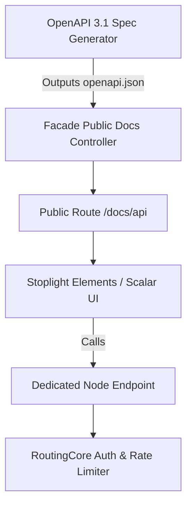

# Comprehensive Implementation Plan: API Specification & Public Documentation

## 1. Executive Summary
This document outlines the end-to-end plan to formalize the APIs Hub RESTful API specification into an interactive, public-facing developer portal. It details architecture decisions, route consolidation, OpenAPI 3.1 generation, documentation rendering, security, and developer experience (DevEx) enhancements.

---

## 2. Objectives
1. **Unified API Contract**: Generate and maintain an accurate, versioned OpenAPI 3.1 specification representing all client-accessible endpoints across normalized channel metrics, sync status, and ping/heartbeat health checks.
2. **Public Developer Documentation Portal**: Provide a modern, responsive, dark-mode-first documentation interface (matching the aesthetic of the features/plans pages) accessible publicly without exposing internal or cluster-management endpoints.
3. **Interactive Sandbox / Try-It Console**: Allow developers to test API requests directly from the browser using sandbox tokens or project keys.
4. **Developer Tooling**: Provide ready-to-run code snippets (cURL, Python, JavaScript, PHP, Power BI) and an exportable Postman collection.

---
## 3. Deep-Dive: Aggregation Endpoint Architecture & Schema (`/metric/aggregate`)

The aggregation engine (`POST /{channel}/metric/aggregate` and `POST /entity/metric/aggregate`) is the computational core of APIs Hub. It allows clients to run arbitrary multi-dimensional analytical queries with time-series groupings, relational filtering, and weighted formulas — identically to the internal dashboard widgets.

### 3.1 Request Payload Schema Specification

```json
{
  "aggregations": {
    "<alias_or_field>": "<formula_or_metric_key>"
  },
  "groupBy": [
    "<dimension_or_date_expression>"
  ],
  "filters": {
    "<field_or_dimension>": "<value_or_operator_object>"
  },
  "startDate": "YYYY-MM-DD",
  "endDate": "YYYY-MM-DD",
  "orderBy": "<field_or_alias>",
  "orderDir": "ASC | DESC",
  "limit": 5000
}
```

#### Field Specifications:

| Parameter | Type | Required | Description |
| :--- | :--- | :--- | :--- |
| `aggregations` | `object` | **Yes** | Key-value pairs where key is the output field name, and value is the metric field or weighted reduction formula (e.g. `'spend'`, `'clicks'`, `'cpc'`, `'ctr'`). |
| `groupBy` | `array<string>` | No | Dimensions to segment results by. Can include temporal expressions (`'date'`, `'week'`, `'month'`), relational keys (`'channeledAccount'`, `'channeledCampaign'`), or raw dimensions (`'query'`, `'device'`, `'country'`, `'dimensions.page'`). |
| `filters` | `object` | No | Constraints applied to records before aggregation. Supports exact equality or rich condition objects. |
| `startDate` | `string` | No | Beginning of date window (`YYYY-MM-DD`). |
| `endDate` | `string` | No | End of date window (`YYYY-MM-DD`). Drives aggregation caching strategies. |
| `orderBy` | `string` | No | Field or aggregation alias to sort by. |
| `orderDir` | `string` | No | Sort direction (`ASC` or `DESC`, default: `ASC`). |
| `limit` | `integer` | No | Row cap (default: 500, max: 5000). |

---

### 3.2 Filter Operator Schema

Filters support both simple scalar equality and structured operator objects:

1. **Scalar Value (Exact Match)**:
   ```json
   "filters": {
     "channeledAccount": "14",
     "country": "USA"
   }
   ```
2. **In Array (Multiple Select)**:
   ```json
   "filters": {
     "channeledAccount": { "operator": "in", "value": ["14", "28", "35"] }
   }
   ```
3. **Not Equal**:
   ```json
   "filters": {
     "dimensions.searchAppearance": { "operator": "not_equal", "value": "standard" }
   }
   ```
4. **Range / Comparison (`>`, `>=`, `<`, `<=`, `between`)**:
   ```json
   "filters": {
     "spend": { "operator": "greater_than", "value": 100 }
   }
   ```
5. **Partial Text Search (`contains`, `starts_with`)**:
   ```json
   "filters": {
     "query": { "operator": "contains", "value": "pricing" }
   }
   ```

---

### 3.3 Multiplicity of Use Cases & Sample Payloads

Below are concrete, production-grade payload examples mapping directly to the platform's widgets:

#### Case 1: KPI Summary Card (Headline Scorecard with Delta Comparison)
*Computes aggregate totals across a given date range without grouping (returns a single summary row).*

- **Endpoint**: `POST /google_search_console/metric/aggregate`
- **Request Body**:
```json
{
  "aggregations": {
    "clicks": "clicks",
    "impressions": "impressions",
    "ctr": "ctr",
    "position": "position"
  },
  "groupBy": [],
  "filters": {
    "channeledAccount": "12",
    "dimensions.searchAppearance": "standard"
  },
  "startDate": "2026-09-01",
  "endDate": "2026-09-24"
}
```
- **Response**:
```json
{
  "status": "success",
  "data": [
    {
      "clicks": 14250,
      "impressions": 389200,
      "ctr": 0.0366,
      "position": 14.2
    }
  ],
  "meta": { "cached": false }
}
```

---

#### Case 2: Time-Series Line / Area Chart (Daily Trends & Smoothing)
*Groups metrics day-by-day for charts. The backend automatically applies temporal gap smoothing.*

- **Endpoint**: `POST /facebook_marketing/metric/aggregate`
- **Request Body**:
```json
{
  "aggregations": {
    "spend": "spend",
    "clicks": "clicks",
    "impressions": "impressions",
    "cpc": "cpc",
    "conversions": "results"
  },
  "groupBy": ["date"],
  "filters": {
    "channeledAccount": { "operator": "in", "value": ["5", "8"] }
  },
  "startDate": "2026-09-01",
  "endDate": "2026-09-24",
  "orderBy": "date",
  "orderDir": "ASC"
}
```
- **Response (Sample row)**:
```json
{
  "status": "success",
  "data": [
    {
      "date": "2026-09-01",
      "spend": 342.50,
      "clicks": 620,
      "impressions": 18450,
      "cpc": 0.552,
      "conversions": 28
    }
  ]
}
```

---

#### Case 3: Granular Breakdown Table (Top Keywords / Pages / Queries)
*Groups metrics by a high-cardinality dimension, sorted by highest volume.*

- **Endpoint**: `POST /google_search_console/metric/aggregate`
- **Request Body**:
```json
{
  "aggregations": {
    "clicks": "clicks",
    "impressions": "impressions",
    "ctr": "ctr",
    "position": "position"
  },
  "groupBy": ["query"],
  "filters": {
    "channeledAccount": "12",
    "dimensions.searchAppearance": "standard"
  },
  "startDate": "2026-09-01",
  "endDate": "2026-09-24",
  "orderBy": "clicks",
  "orderDir": "DESC",
  "limit": 50
}
```

---

#### Case 4: Multi-Dimensional Slice & Dice (Channel + Device + Country)
*Simultaneous grouping across multiple entity hierarchy levels.*

- **Endpoint**: `POST /google_analytics/metric/aggregate`
- **Request Body**:
```json
{
  "aggregations": {
    "sessions": "sessions",
    "pageviews": "screenPageViews",
    "activeUsers": "activeUsers",
    "bounceRate": "bounceRate"
  },
  "groupBy": [
    "device",
    "country",
    "dimensions.sessionDefaultChannelGroup"
  ],
  "filters": {
    "channeledAccount": "3"
  },
  "startDate": "2026-09-01",
  "endDate": "2026-09-24",
  "orderBy": "sessions",
  "orderDir": "DESC",
  "limit": 100
}
```

---

#### Case 5: Unified Cross-Channel Omnichannel Query (`/entity/metric/aggregate`)
*Combines Google, Meta, Klaviyo, and Shopify data into a single query for executive dashboards.*

- **Endpoint**: `POST /entity/metric/aggregate`
- **Request Body**:
```json
{
  "aggregations": {
    "total_spend": "spend",
    "total_reach": "reach",
    "total_conversions": "results"
  },
  "groupBy": [
    "channel",
    "date"
  ],
  "filters": {
    "channel": { "operator": "in", "value": ["google_search_console", "facebook_marketing"] }
  },
  "startDate": "2026-09-01",
  "endDate": "2026-09-24",
  "orderBy": "date",
  "orderDir": "ASC"
}
```

---

### 3.4 Aggregation Response Metadata (`meta`)

All aggregation endpoints return contextual execution telemetry in the `meta` object:
- `cached`: `true` if served from Redis/Filesystem cache; `false` if executed on SQL.
- `cache_type`: `historical` (static archive), `recent` (dynamic sliding window), or `null`.
- `execution_path`: Either `optimized` (using specialized pre-indexed channel strategies) or `legacy` (fallback query planner).
- `fallback_reason`: Present if planner downgraded to standard SQL (e.g. `unsupported_group_pattern`).


## 4. Architectural Design & Phasing



### Phase 1: OpenAPI 3.1 Specification Generation
- **Generator Command**: Implement an automated Artisan command in `apis-hub-facade` (`php artisan apis-hub:generate-openapi-spec`) that scans driver definitions and controller contracts to generate `storage/specs/openapi.json`.
- **Dynamic Schema Enrichment**:
  - Parameter types, query filters, and response models derived directly from `api-driver-core` entities and driver profiles.
  - Inclusion of channel enumerations (`google_search_console`, `google_analytics`, `facebook_marketing`, `facebook_organic`, `shopify`, `klaviyo`, etc.).

### Phase 2: Public Documentation Route & Layout
- **Route**: `GET /docs/api` (English) and `GET /es/docs/api` (Spanish) in `apis-hub-facade`.
- **Header & Footer Alignment**:
  - Embed documentation into the global public layout (`resources/views/components/public/header.blade.php` and `footer.blade.php`).
- **Rendering Engine Evaluation**:
  - **Option A (Recommended)**: **Scalar** (`@scalar/api-reference`): Ultra-modern, responsive, dark-mode native, zero-runtime server dependencies.
  - **Option B**: **Stoplight Elements**: Highly customizable with three-column API layout.

### Phase 3: Interactive Sandbox & Client Key Injector
- Enable interactive query testing by allowing users to paste their project public API key into the console header.
- Provide a default "Demo Read-Only Sandbox" endpoint configured with anonymized sample data.

### Phase 4: Developer Assets & SDK Generation
- Exportable **Postman Collection v2.1** downloadable with 1-click.
- Automated code snippet generation inside the docs (cURL, Python `requests`, Node `fetch`, PHP `Guzzle`, Go, Power BI M-Query).

---

## 5. Security & Rate Limiting Integration
1. **Strict Key Scoping**: Public documentation will explicitly distinguish between `APP_API_KEY` (client external integrations) and internal admin keys.
2. **Quota Transparency**: The documentation will include a dedicated rate-limit table detailing tier caps:
   - Ultra / Founder: 500 req/min
   - Enterprise: 1,000 req/min
3. **CORS Configuration**: Ensure Caddy / Swoole server configuration permits preflight `OPTIONS` requests from web-based BI connectors.

---

## 6. Implementation Checklist & Deliverables

| Step | Task | Deliverable | Status |
| :--- | :--- | :--- | :--- |
| **1.1** | Define public endpoint OpenAPI YAML/JSON schema | `storage/specs/openapi.json` | Planned |
| **2.1** | Create Controller for public API documentation | `App\Http\Controllers\ApiDocsController` | Planned |
| **2.2** | Build Blade view utilizing Scalar UI | `resources/views/api-docs.blade.php` | Planned |
| **2.3** | Unify header and navigation links | Header dropdown in `header.blade.php` | Planned |
| **3.1** | Add interactive key header injection in UI | LocalStorage API Key state | Planned |
| **4.1** | Generate exportable Postman collection | `/downloads/apis-hub.postman_collection.json` | Planned |
| **5.1** | Update `sitemap.xml` with `/docs/api` | `public/sitemap.xml` | Planned |
