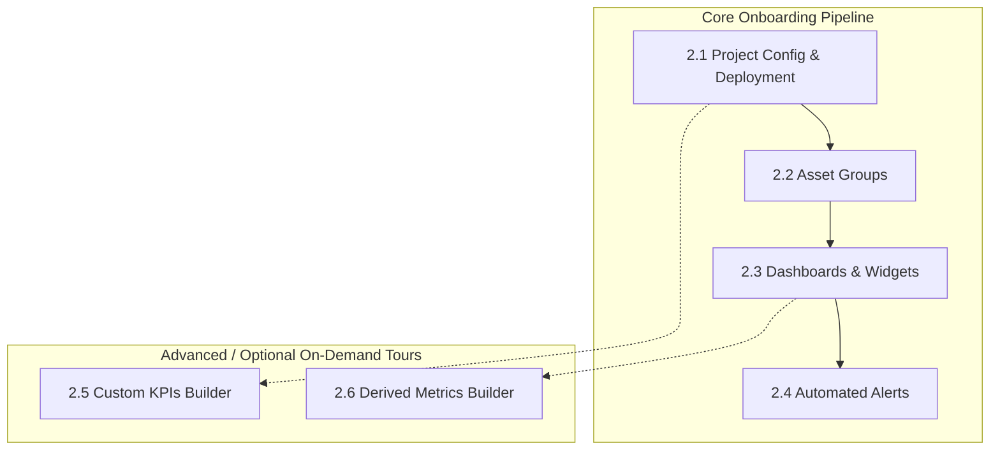
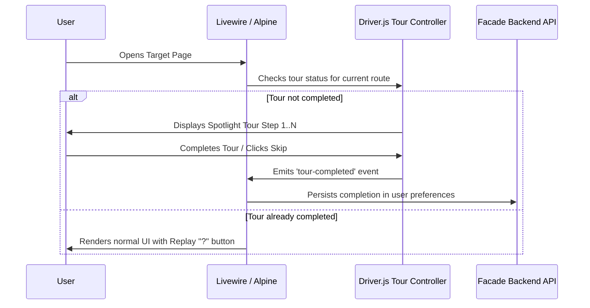

# Onboarding UI Tooltips & Guided Walkthroughs Proposal
**Document Target:** APIs Hub Facade (`apis-hub-facade`)  
**Status:** Approved Architecture / Detailed Flow Specification  
**UX Model:** Hybrid "Getting Started" Checklist + Targeted Tours  
**Date:** 2026-08-21  

---

## 1. Architecture & UX Model Overview

Based on evaluation, APIs Hub Facade adopts **Option C: Hybrid "Getting Started" Checklist + Targeted Tours**:

1. **Macro Onboarding (Dashboard Setup Checklist Widget)**:
   - Appears as a sleek, collapsible card on the primary Dashboard (`0/4 Milestones Completed`).
   - Tracks the user's high-level progression through the 4 core setup stages:
     1. `Project Configuration & Deployment`
     2. `Asset Groups Setup`
     3. `Dashboard & Widgets Configuration`
     4. `Alerts Setup`
   - Advanced/optional stages (`Custom KPIs`, `Derived Metrics`) are accessible as on-demand modules.
   - Clicking any milestone directs the user to that exact page and automatically launches that stage's targeted tour.

2. **Micro Onboarding (Targeted Spotlight Page Tours)**:
   - Powered by **Driver.js** (zero-dependency, dark glassmorphism styling, smooth SVG spotlight animation).
   - Dims background and highlights exact controls with concise explanations, `Next`, `Back`, and `Skip Tour`.
   - Each page includes a subtle **"Take a Tour" / "?"** button in the header so users can replay any walkthrough at any time.

---

## 2. Onboarding Flows Specification



---

### Flow 2.1: Project Configuration & Deployment

#### 2.1.1 Data Sources (`/app/{tenant}/data-sources`)
* **Step 1 — Channel Connection**: Highlight the OAuth connect button (Meta Ads, Google Analytics, Shopify, Klaviyo). Explain authorizing data access.
* **Step 2 — Asset Selection**: Point to discovered assets table (ad accounts, Google properties, stores). Explain toggling checkboxes to enable sync.
* **Step 3 — Save Changes**: Highlight the save button to persist chosen accounts into the tenant configuration.

#### 2.1.2 Project Settings & Deployment (`/app/{tenant}/settings`)
* **Step 1 — Timezone & Regional Settings**: Highlight the timezone selector to ensure normalization alignment with ad account reporting windows.
* **Step 2 — Project Deployment**: Highlight the "Deploy Project" button, explaining that this provisions the dedicated tenant worker container.
* **Step 3 — Deployment Status Monitor**: Point out the live deployment progress bar and SSH status feed.

#### 2.1.3 Telemetry Monitoring (`/app/{tenant}/telemetry`)
* **Step 1 — Channel Sync Verification**: Explain real-time sync status indicators and worker heartbeats, ensuring data ingestion completes before building analytics.

#### 2.1.4 Data Explorer (`/app/{tenant}/data-explorer`)
* **Step 1 — Channel Selection**: Highlight switching between channels (Meta, Google, Shopify).
* **Step 2 — Controls & Raw Data Inspection**: Show date range pickers, metrics selectors, and the normalized data grid to verify synced records.

---

### Flow 2.2: Asset Groups

#### 2.2.1 Unique Asset Group Flow (`/app/{tenant}/asset-groups/create`)
* **Step 1 — Group Naming**: Highlight the Name input (e.g. "US E-commerce Stores", "Brand Search Campaigns").
* **Step 2 — Multi-Channel Asset Selection**: Show multi-select interface grouping ad accounts from Meta, Google, and stores into a single logical cluster.
* **Step 3 — Save & Activate**: Highlight the save button and explain how this group unlocks global filtering across dashboards.

---

### Flow 2.3: Dashboards & Widgets

#### 2.3.1 Dashboard Creation & Controls (`/app/{tenant}/dashboards/create`)
* **Step 1 — Global Dashboard Configuration**: Highlight title, description, and default date preset (e.g. Last 30 Days).
* **Step 2 — Dashboard Controls & Asset Group Selector**: Highlight the `Show Asset Group Selector` toggle, explaining how it gives viewers instant filter dropdowns on the finished dashboard.
* **Step 3 — Save & Open Builder**: Save the dashboard to enter the visual grid builder.

#### 2.3.2 Widget Builder & Layout (`/app/{tenant}/dashboards/{id}/edit`)
* **Step 1 — Add New Widget**: Highlight the `+ Add Widget` button opening the widget drawer.
* **Step 2 — Select Widget Type**: Explain KPI Cards, Multi-Channel Trend Charts, Blended Matrix Tables, and Donut Breakdowns.
* **Step 3 — Chart & Table Configurations**: Explain selecting metrics, dimensions, aggregations, and comparison periods.
* **Step 4 — GridStack Drag & Resize**: Demonstrate dragging tiles and grabbing bottom-right corner handles to resize.
* **Step 5 — Widget Multi-Selection & Bulk Operations**: Explain `Shift + Click` selection for bulk repositioning and alignment.
* **Step 6 — Layout Saving**: Point to the "Save Layout" action to persist the grid positions.
* **Step 7 — Snapshot Versioning**: Highlight layout versioning/restore history.

#### 2.3.3 Live Dashboard View (`/app/{tenant}/dashboards/{id}`)
* **Step 1 — Viewer Mode**: Explain reading dynamic metrics, switching asset group filters in real time, and exporting dashboard PDF/CSV reports.

---

### Flow 2.4: Automated Alerts

#### 2.4.1 Step-by-Step Alert Configuration (`/app/{tenant}/alerts/create`)
* **Step 1 — Alert Name & Target Scope**: Highlight naming and selecting target channels/assets.
* **Step 2 — Calculation Lines & Formula Builder**: Highlight AST calculation rules (e.g., `spend > 500 && roas < 1.8`), explaining how operands evaluate live normalized data.
* **Step 3 — Thresholds & Anomaly Bounds**: Explain static bounds (Min/Max) vs dynamic trend anomaly limits.
* **Step 4 — Evaluation Frequency (Schedule)**: Explain hourly vs daily cron evaluation runs.
* **Step 5 — Notification Channels**: Highlight toggles for In-App Toast alerts and email recipient list.

---

### Optional / Advanced On-Demand Tours

#### Flow 2.5: Custom KPIs Builder (`/app/{tenant}/custom-kpis`)
* **Step 1 — Multi-Stream Blending**: Explain creating bespoke blended business metrics (e.g., Blended ROAS, CAC).
* **Step 2 — Series Assignment (`a`, `b`, `c`)**: Highlight assigning variable letters to specific channel queries.
* **Step 3 — Formula AST Editor**: Show arithmetic expressions with live syntax validation and historical evaluation preview.

#### Flow 2.6: Derived Metrics (`/app/{tenant}/derived-metrics`)
* **Step 1 — Single-Channel Metric Transformations**: Explain creating calculated metrics within a single provider before cross-channel aggregation.
* **Step 2 — Testing & Mapping**: Show preview evaluation and mapping into dashboard widget selectors.

---

## 3. Technical Implementation Plan



### 3.1 Tour Registry Architecture (`resources/js/tours/`)

```
resources/js/tours/
├── index.js                     # Tour registry & route matcher
├── driver-theme.css             # Glassmorphism dark mode stylesheet for Driver.js
├── flows/
│   ├── data-sources-tour.js     # Flow 2.1.1
│   ├── project-settings-tour.js # Flow 2.1.2
│   ├── telemetry-tour.js        # Flow 2.1.3
│   ├── data-explorer-tour.js    # Flow 2.1.4
│   ├── asset-groups-tour.js     # Flow 2.2.1
│   ├── dashboard-builder-tour.js# Flow 2.3.1 & 2.3.2
│   ├── alerts-tour.js           # Flow 2.4.1
│   ├── custom-kpis-tour.js      # Flow 2.5 (Optional)
│   └── derived-metrics-tour.js  # Flow 2.6 (Optional)
```

### 3.2 State Persistence Model

1. **Storage**: Stored in `users.preferences` JSON column under `completed_tours: string[]`.
2. **Local Cache**: Mirror in `localStorage.getItem('apis_hub_tours')` for instantaneous zero-latency check on page load.
3. **Replay Ability**: Any page's header action button dispatches `window.dispatchEvent(new CustomEvent('start-page-tour', { detail: { force: true } }))`.

---

## 4. Implementation Phasing

| Phase | Deliverables | Target Scope |
| :--- | :--- | :--- |
| **Phase 1: Driver.js Core & Theme** | • Install `driver.js`<br>• Create `driver-theme.css` matching APIs Hub dark palette<br>• Setup Alpine.js `$store.onboarding` | Infrastructure |
| **Phase 2: Project Deployment & Setup (Flow 2.1)** | • Data Sources tour<br>• Project Settings & Deploy tour<br>• Telemetry & Data Explorer tours | Flow 2.1 |
| **Phase 3: Asset Groups & Dashboards (Flow 2.2 & 2.3)** | • Asset Groups tour<br>• Dashboard Builder & GridStack tours<br>• Viewer Mode tour | Flow 2.2 & 2.3 |
| **Phase 4: Alerts & Advanced (Flow 2.4, 2.5, 2.6)** | • Step-by-step Alert configuration tour<br>• Custom KPIs & Derived metrics on-demand tours | Flow 2.4, 2.5, 2.6 |
| **Phase 5: Dashboard Getting Started Checklist** | • Collapsible checklist widget on primary Dashboard<br>• Dynamic milestone progress tracking | Macro UX |
