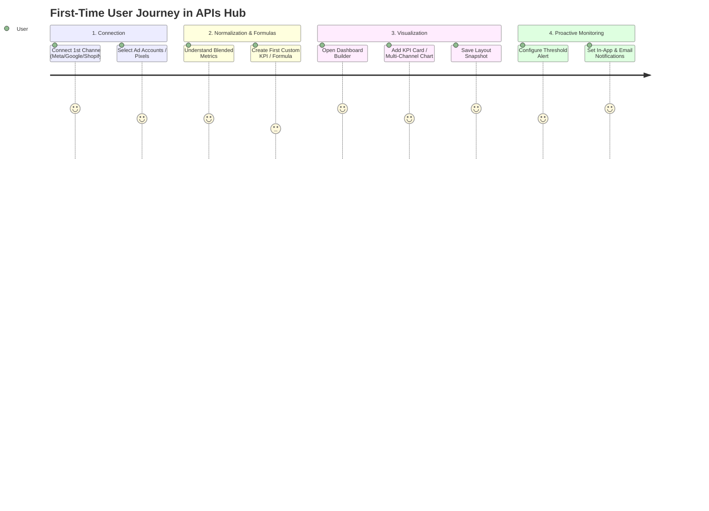
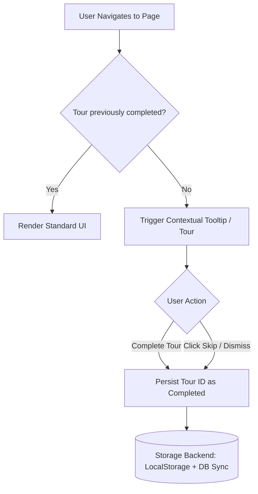

# Onboarding UI Tooltips & Guided Walkthroughs Proposal
**Document Target:** APIs Hub Facade (`apis-hub-facade`)  
**Status:** Proposal / Review  
**Date:** 2026-08-21  

---

## 1. Executive Summary

As APIs Hub scales its feature set (multi-channel normalization, custom AST KPI formulas, drag-and-drop dashboard grid, and anomaly alert threshold configuration), first-time users can benefit significantly from a structured, non-intrusive onboarding system.

This proposal outlines the UX interaction patterns, target pages, technical architecture, and state persistence models to provide contextual guidance without cluttering the interface.

---

## 2. High-Value Onboarding Flow & Key Pages



### Detailed Target Pages & Touchpoints

| Target Page / Area | Core Concepts to Explain | Target DOM Anchor Points |
| :--- | :--- | :--- |
| **1. Data Sources**<br>`/app/data-sources` | • **OAuth Integration**: How to connect Meta, Google, Shopify, Klaviyo, etc.<br>• **Asset Discovery**: Selecting specific ad accounts, properties, or stores.<br>• **Sync Indicators**: Real-time worker sync heartbeat and status. | • `#connect-channel-btn`<br>• `#assets-selection-table`<br>• `#sync-status-indicator` |
| **2. Dashboard Builder**<br>`/app/dashboards/{id}/edit` | • **Widget Palette**: Adding KPI Cards, Line Charts, Matrices, and Donuts.<br>• **Global Controls**: Date ranges, channel filters, asset selectors.<br>• **Grid Customization**: Drag, drop, resize, and snapshot versioning. | • `#btn-open-add-widget`<br>• `#dashboard-global-controls`<br>• `.grid-stack-item:first-child` |
| **3. Custom KPIs**<br>`/app/custom-kpis` | • **Blended Math**: Arithmetic across channels (e.g. `(fb_spend + google_spend) / conversions`).<br>• **Series Variables**: Assigning letter keys (`a`, `b`) to data streams.<br>• **Live Evaluator**: Testing formula outputs with historical data. | • `#kpi-formula-editor`<br>• `#source-series-repeater`<br>• `#formula-preview-badge` |
| **4. Alerts Management**<br>`/app/alerts` | • **Threshold Rules**: Defining upper/lower limits or anomaly bounds.<br>• **Schedule Cadence**: Explaining cron evaluation intervals (Daily/Hourly).<br>• **Notification Channels**: In-app toast alerts vs email dispatch. | • `#create-alert-wizard`<br>• `#schedule-cron-selector`<br>• `#notification-channels-group` |
| **5. Projects & Billing**<br>`/app/projects`, `/app/billing` | • **Role-Based Access**: Owner, Admin, Collaborator permissions.<br>• **Billing Profiles**: Explaining that subscriptions attach to billing profiles, not personal accounts. | • `#project-switcher-dropdown`<br>• `#billing-profile-sponsorship` |

---

## 3. UX Interaction Models: Architectural Comparison

### Option A: Step-by-Step Guided Product Tour (e.g. Driver.js / Shepherd.js)
* **Visual Behavior**: Dims the background with a smooth dark overlay, highlights the exact element in a spotlight box, and shows a floating card with `Step 1 of 4`, `Next`, `Back`, and `Dismiss`.
* **When Triggered**: Automatically on the user's first visit to a page, or manually when clicking a *"Take a quick tour"* button.
* **Pros**: 
  - Comprehensive, leaves zero ambiguity.
  - Users are guided through a complete workflow in 30 seconds.
* **Cons**:
  - Can feel intrusive if forced without an easy exit.

---

### Option B: Contextual Pulsing Beacons / Hotspots (Alpine.js + Floating UI / Tippy.js)
* **Visual Behavior**: A subtle glowing brand-blue dot (beacon) pulses next to complex controls (e.g., Formula AST Editor, Global Controls Bar).
* **When Triggered**: Passive. When the user hovers or clicks the beacon, a sleek popover expands with micro-explanations or GIF animations.
* **Pros**:
  - 100% self-paced and non-blocking.
  - Does not disrupt experienced users.
* **Cons**:
  - Passive discovery; users might ignore them during urgent tasks.

---

### Option C: Hybrid "Getting Started" Checklist + Targeted Tours (Recommended)
* **Visual Behavior**:
  1. A compact, collapsible **"Getting Started" card** on the main dashboard (`0/4 Completed`):
     - `[✓] Connect your first Data Source`
     - `[ ] Build your first Custom KPI`
     - `[ ] Create your first Dashboard Widget`
     - `[ ] Set up an Automated Alert`
  2. Clicking any checklist item routes to the page and automatically highlights that page's 2-step tour.
  3. Individual pages retain subtle **"Help"** icons in the top bar to replay tours on demand.
* **Pros**:
  - Gives users a clear sense of progress and gamification.
  - Connects macro onboarding (full SaaS setup) with micro onboarding (page-level tooltips).

---

## 4. State Management & Tour Dismissal Persistence

To prevent repetitive tour prompts across sessions:



### Proposed Storage Strategies

1. **Client-Side Storage (`localStorage`)**:
   - `localStorage.setItem('apis_hub_tour_datasources', 'completed');`
   - Instant response, zero database queries.

2. **Server-Side Storage (`UserPreference` / `user.meta`)**:
   - Store array in database: `user.preferences.completed_tours = ['data_sources', 'dashboard_builder']`.
   - Ensures tour progress is synced across multiple browsers and devices.

3. **Hybrid Approach**:
   - Load initial completed tour keys on login into Alpine store `$store.onboarding.tours`.
   - Update `localStorage` immediately, and sync to `/api/user/preferences` in background.

---

## 5. Technical Implementation Blueprint

### 5.1 Library Recommendation: [Driver.js](https://driverjs.com/)
* **Why Driver.js?**
  - Ultra-lightweight (~5KB gzipped), zero external runtime dependencies.
  - Full TypeScript and vanilla JavaScript support.
  - Native dark mode and glassmorphism styling support.
  - Smooth SVG backdrop spotlight animation that automatically follows DOM element resizes.

### 5.2 Tour Definition Example (`resources/js/tours/data-sources-tour.js`)

```javascript
import { driver } from "driver.js";
import "driver.js/dist/driver.css";

export function initDataSourcesTour() {
    const isCompleted = localStorage.getItem('tour_data_sources_completed');
    if (isCompleted) return;

    const tourDriver = driver({
        showProgress: true,
        animate: true,
        allowClose: true,
        doneBtnText: 'Finish',
        nextBtnText: 'Next →',
        prevBtnText: '← Back',
        onDestroyed: () => {
            localStorage.setItem('tour_data_sources_completed', 'true');
        },
        steps: [
            {
                element: '#channel-connections-grid',
                popover: {
                    title: 'Connect Your Channels',
                    description: 'Authorize your Meta Ads, Google Analytics, Shopify, or Klaviyo integrations with a single click.',
                    side: 'bottom',
                    align: 'start'
                }
            },
            {
                element: '#discovered-assets-card',
                popover: {
                    title: 'Select Active Assets',
                    description: 'Choose the specific ad accounts, properties, or stores you want to normalize and monitor.',
                    side: 'top',
                    align: 'center'
                }
            },
            {
                element: '#sync-status-badge',
                popover: {
                    title: 'Sync Health & Heartbeat',
                    description: 'Check background worker ingestion status and token refresh lifecycle here.',
                    side: 'left',
                    align: 'center'
                }
            }
        ]
    });

    tourDriver.drive();
}
```

### 5.3 Filament Integration via Render Hooks

In `app/Providers/Filament/AppPanelProvider.php`:

```php
->renderHook(
    'panels::body.end',
    fn () => Blade::render('@include(\'filament.hooks.onboarding-tours\')')
)
```

---

## 6. Implementation Roadmap

- [ ] **Phase 1: Foundation & Package Evaluation**
  - Install Driver.js or assemble Alpine.js floating beacon component.
  - Build theme-matched styling (dark glassmorphism, brand-blue glowing buttons, Outfit font).
- [ ] **Phase 2: Core Page Tours**
  - **Tour 1**: Data Sources (`/app/data-sources`)
  - **Tour 2**: Dashboard Builder & Widget Creation (`/app/dashboards/{id}/edit`)
  - **Tour 3**: Custom KPI AST Formula Builder (`/app/custom-kpis`)
- [ ] **Phase 3: Persistence & Replay Controls**
  - Implement `$store.onboarding` in Alpine.js.
  - Add **"Quick Tour"** action button in page headers to replay anytime.
- [ ] **Phase 4: Dashboard "Getting Started" Checklist**
  - Implement collapsible setup widget for new projects with zero connected sources.

---

## 7. Next Steps for Review

1. Confirm preferred UX model (**Option A: Guided Spotlight**, **Option B: Pulsing Beacons**, or **Option C: Hybrid Checklist + Tours**).
2. Confirm initial priority pages for the rollout.
3. Review styling integration with existing Filament dark theme.
